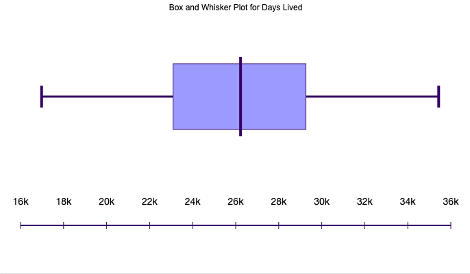

## Summary
This was a fun and challenging project. While I am familiar with interpreted languages and data manipulation libraries,
I had never worked with either Python or Pandas previous to this project. Picking up this new language and framework was
a very rewarding experience. 

While this project could have been done with plain Python, I chose to use a data
manipulation tool (Panda) because it is the most efficient way to work with table-formatted data, even with 
a small dataset such as this one. Additionally, I would be using a tool similar to this for any serious development,
so I thought using it here would be a good way to showcase my skills with it.

## Tables and Plots

With data as of October 8th, 2021

#### Top 10 longest and shortest living presidents
```
The 10 longest living presidents are: 
+----+------------------+--------------+
|    | PRESIDENT        |   DAYS LIVED |
|----+------------------+--------------|
| 37 | Jimmy Carter     |        35436 |
| 39 | George Bush      |        34504 |
| 36 | Gerald Ford      |        34133 |
| 38 | Ronald Reagan    |        34088 |
|  1 | John Adams       |        33119 |
| 29 | Herbert Hoover   |        32943 |
| 31 | Harry S. Truman  |        32373 |
|  3 | James Madison    |        31150 |
|  2 | Thomas Jefferson |        30397 |
| 35 | Richard Nixon    |        29688 |
+----+------------------+--------------+


The 10 longest living presidents are: 
+----+------------------+--------------+
|    | PRESIDENT        |   DAYS LIVED |
|----+------------------+--------------|
| 37 | Jimmy Carter     |        35436 |
| 39 | George Bush      |        34504 |
| 36 | Gerald Ford      |        34133 |
| 38 | Ronald Reagan    |        34088 |
|  1 | John Adams       |        33119 |
| 29 | Herbert Hoover   |        32943 |
| 31 | Harry S. Truman  |        32373 |
|  3 | James Madison    |        31150 |
|  2 | Thomas Jefferson |        30397 |
| 35 | Richard Nixon    |        29688 |
+----+------------------+--------------+
```

#### Calculations
```
Mean: 26365.78 days
Median:  26227.0  days
Mode:  [16978, 18202, 19583, 20516, 20863, 21091, 21412, 21980, 21985, 22099, 23082, 23098, 23524, 23695, 23967, 24320, 24507, 24676, 24767, 24890, 25673, 26030, 26227, 26471, 26729, 27088, 27444, 27488, 27510, 28163, 28574, 28654, 28812, 29085, 29446, 29688, 30397, 31150, 32373, 32943, 33119, 34088, 34133, 34504, 35436]  days
Max:  35436  days
Max:  16978  days
STD: 4564.54 days
Weighted average:  26365.78 days
```

#### Plot

I chose to use a box-and-whisker plot because it displays the relationship between 
the max, the min, and the average. Additionally, it allows us to see if the data is skewed 
in any direction due to the presence of outliers. I used an online tool to create this graphic using the
`DAYS LIVED` column.

## Running the project
To run the project: 
1. Install dependencies
2. Run `main.py` file

```shell
pip install pandas --user
pip install tabulate --user
python main.py
```

The above commands will install all dependencies and run the main file.
The main file will output the steps and data for each part of the project.

## Notes on Calculations

`mode` - since as of today, no presidents have lived the same amount of days, all `days_lived   ` 
entries occur once. Since `1` is the highest number of occurrances for any entry, and also the one for all entries,
all entries are part of the mode.

`weighted mean` - since we have no weights in this dataset, the weighted mean should equal the `mean    `, 
even after following the formula listed in the resources.

#### NOTE: I used the built in pandas statistics function, but I'll gladly go over how to implement each of them programatically in person :)

## Conclusion
Learning to use Python, Pandas, and the other libraries available in the Python environment was at times a bit challenging,
but very rewarding. I am glad this assessment was able to not only showcase my programming and problem-solving knowledge, 
but also serve as a learning experience. I look forward to further discussing this project, what I did correctly,
and what I could have done better. Thank you!